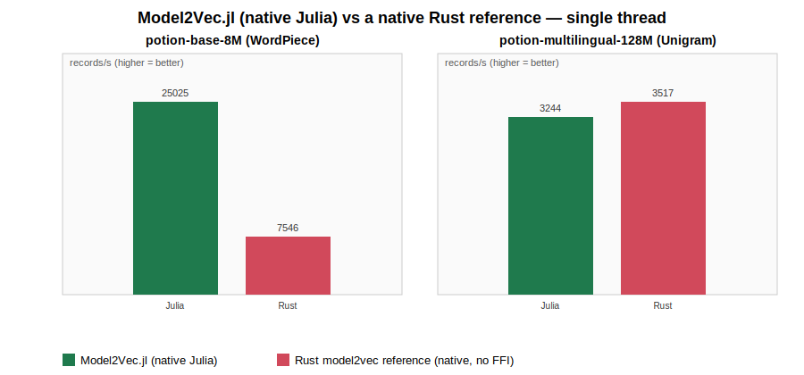

# Model2Vec.jl

[](LICENSE)

Native-Julia inference for [model2vec](https://github.com/MinishLab/model2vec) static embedding
models — **allocation-free** for `WordPiece` models, and faster than a native (no-FFI) Rust
reference implementing the same algorithm, for both tokenizer families model2vec ships with.

A model2vec model is *tokenize → look up a per-token embedding row → mean-pool → optionally
L2-normalize*. The tokenizer is the expensive part, and model2vec models use one of two
tokenizer families depending on the checkpoint:

* **WordPiece** (BERT-style, e.g. `minishlab/potion-base-8M`) — greedy longest-match per word.
* **Unigram** (SentencePiece-style, e.g. `minishlab/potion-multilingual-128M`) — Viterbi
  segmentation over a byte-trie of the vocabulary.

This package implements both directly in Julia, over raw UTF-8 bytes, with no FFI.

<p align="center"></p>

| 4,000-record synthetic corpus, M1 Max, single thread | throughput | vs Rust |
|---|---:|---:|
| **WordPiece** (`potion-base-8M`) — Julia | **457,841 records/s, 0 allocs** | **6.60x** |
| WordPiece — Rust (native, no FFI) | 69,332 records/s | 1.00x |
| **Unigram** (`potion-multilingual-128M`) — Julia | **79,553 records/s** | **1.11x** |
| Unigram — Rust (native, no FFI) | 71,398 records/s | 1.00x |

<sub>Reproduce: `bench/run.sh` (downloads nothing beyond what's already in your local HF cache;
generates a deterministic multilingual corpus, builds the Rust reference, runs both). The Rust
side is a plain binary — no FFI, no jlrs, the same tokenize→pool→normalize algorithm — so this is
the fairest comparison available, not an FFI-overhead artifact.</sub>

**In production**: [MonsieurPapin](https://github.com/D3MZ/MonsieurPapin.jl) switched its
embedding-scoring path from an in-process Rust FFI bridge to this package after a head-to-head
benchmark over 21,465 real web-crawl records (`potion-multilingual-128M`, Unigram) — **2.4-2.6x
faster**, 0.998 score correlation with the Rust bridge it replaced. See MonsieurPapin's
`test/benchmarks.jl` for that comparison, which now runs as a standing regression guard.

## Install

```julia
pkg> add https://github.com/D3MZ/Model2Vec.jl
```

## Usage

```julia
using Model2Vec

model = Model2Vec.load(modeldir)          # a local model2vec snapshot (tokenizer.json,
                                           # model.safetensors, config.json)
v = Model2Vec.encode(model, "cat dog")    # Vector{Float32}, length == model.dim

# Reuse buffers across many calls (this is what makes the hot loop allocation-free for
# WordPiece models):
scratch = Model2Vec.Scratch(model)
for text in many_texts
    v = Model2Vec.encode!(scratch, model, text)   # owned by scratch; copy if you keep it
end
```

`load` auto-detects the tokenizer family from `tokenizer.json` — the same `encode`/`encode!`
calls work for either.

## Scope

Case-folding and whitespace/punctuation handling are byte-level ASCII. Full Unicode
normalization is approximated, not implemented byte-for-byte:

* **WordPiece**: no accent stripping; non-ASCII words are skipped (contribute no tokens) rather
  than mis-tokenized, since WordPiece's `##`-continuation search assumes single-byte characters.
* **Unigram**: the SentencePiece `Precompiled` charsmap (a binary Unicode-folding table) is
  approximated with `Unicode.normalize` (NFKC + control/ignorable stripping). This matches the
  reference tokenizer closely on ASCII/Latin-script text; on non-Latin-script text (tested
  against real multilingual web text) embeddings can diverge from the reference by a few percent
  of cosine distance in the worst case.

Both gaps are about matching a reference byte-for-byte on non-ASCII input, not about crashing or
producing garbage — every input, ASCII or not, still tokenizes and pools to a valid embedding.

## How it works

Both backends load the target model directory once (tokenizer vocab into either a `Dict`-pair
for WordPiece or a byte-trie for Unigram, plus the embedding matrix as a zero-copy reshape of
the safetensors file), then reuse a `Scratch` buffer across calls so tokenization never
allocates a fresh `String` per candidate: WordPiece looks up `Dict{String,Int32}` vocab maps
using `SubString`s of a `StringView` wrapped around a persistent scratch buffer (verified
empirically to be a zero-allocation lookup key); Unigram walks a trie built once at load time to
run Viterbi segmentation without per-position string allocation.

## License

MIT © Demetrius Michael · `bench/run.sh` reproduces the numbers above.
